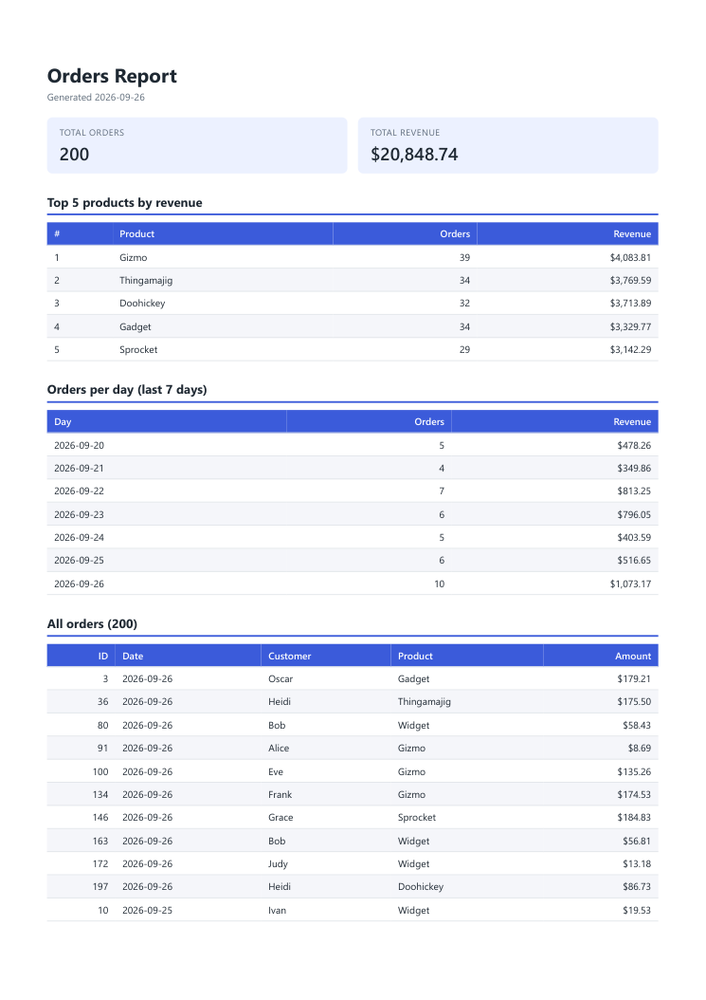

# FlyRank A8: PDF Report Generator

A small FastAPI service that turns a SQLite `orders` table into a downloadable PDF report.
`POST /reports` aggregates the orders, renders an HTML report to an A4 PDF with headless Chromium (Playwright), saves the PDF to `reports/{id}.pdf` and returns a **link** to it.
The API only ever returns JSON metadata and links. PDF bytes are served only from `GET /reports/{id}/file`.

## Endpoints

| Method | Path | Returns |
|---|---|---|
| GET | `/health` | `{"status": "ok"}` |
| POST | `/reports` | `201 {id, file}` for a new report, `200 {id, file}` if today's report already exists. Body `{"force": true}` always generates a new one. |
| GET | `/reports/{id}` | The report row as JSON: `{id, path, created_at, file}` (never the bytes) |
| GET | `/reports/{id}/file` | The PDF itself (`application/pdf`, via `FileResponse`) |

## How to run

```bash
python -m venv venv
venv\Scripts\activate            # Windows  (macOS/Linux: source venv/bin/activate)
pip install -r requirements.txt   # fastapi, uvicorn, playwright (sqlite3 is built in)
playwright install chromium

python seed.py                    # creates report.db with 200 random orders (safe to re-run)
python -m uvicorn main:app --reload
```

Then:

```bash
curl -X POST http://127.0.0.1:8000/reports
curl -o report.pdf http://127.0.0.1:8000/reports/1/file
```

Other entry points: `python report.py` prints the aggregated JSON, and `python pdf.py` writes `reports/test.pdf`.

## Project layout

| File | Purpose |
|---|---|
| `db.py` | SQLite connection + schema (`orders`, `reports`) |
| `seed.py` | Idempotent seed: `DELETE FROM orders`, then insert 200 random orders (6 products, $5–$200, last 30 days) |
| `report.py` | `get_report_data()` / `getReportData`: the aggregation queries |
| `pdf.py` | `render_pdf()` / `renderPDF`: HTML template → Playwright → PDF |
| `main.py` | FastAPI app |

## SQL

```sql
-- total_orders
SELECT COUNT(*) AS total_orders FROM orders;

-- total_revenue
SELECT ROUND(COALESCE(SUM(amount), 0), 2) AS total_revenue FROM orders;

-- top_5_products
SELECT product,
       COUNT(*)              AS orders,
       ROUND(SUM(amount), 2) AS revenue
FROM orders
GROUP BY product
ORDER BY revenue DESC
LIMIT 5;

-- orders_per_day_7days (today and the 6 days before it; empty days are filled with 0 in Python)
SELECT created_at            AS day,
       COUNT(*)              AS orders,
       ROUND(SUM(amount), 2) AS revenue
FROM orders
WHERE created_at >= DATE('now', 'localtime', '-6 days')
GROUP BY created_at
ORDER BY created_at;

-- idempotency check (inside BEGIN IMMEDIATE)
SELECT id FROM reports WHERE created_at = :today ORDER BY id DESC LIMIT 1;
```

## Clean page breaks

The 200-order table spans 7 A4 pages. `tr { break-inside: avoid; }` keeps every row whole, and putting the column headings in a `<thead>` (`display: table-header-group`) makes Chromium repeat them at the top of each page.
To check, I extracted text from every page of `reports/test.pdf`: all 200 order rows parse as complete rows, and each page has the header.

## Proof of download

Run against a live server (today's report already existed, hence `200`):

```text
$ curl -s -X POST http://127.0.0.1:8765/reports -w "  [HTTP %{http_code}]\n"
{"id":2,"file":"/reports/2/file"}  [HTTP 200]

$ curl -s http://127.0.0.1:8765/reports/2
{"id":2,"path":"reports/2.pdf","created_at":"2026-09-26","file":"/reports/2/file"}

$ curl -sS -o report-2.pdf -D - http://127.0.0.1:8765/reports/2/file
HTTP/1.1 200 OK
server: uvicorn
content-type: application/pdf
accept-ranges: bytes
content-disposition: attachment; filename="report-2.pdf"
content-length: 57576
last-modified: Sat, 26 Sep 2026 06:54:12 GMT
etag: "b78f24d600a49559e506d7bdd40cbf27"

$ file report-2.pdf
report-2.pdf: PDF document, version 1.4, 7 page(s)
```

Page 1 of the downloaded `report-2.pdf`:



## Notes

**Stage 4 timing:** On this machine a new report takes about 1 second end to end (`POST /reports` measured at 0.93–1.08 s). Nearly all of that is launching headless Chromium and printing the PDF; the SQL takes a few milliseconds. A cached same-day hit returns in about 0.2 s or less.

**Why Stage 5 matters:** Without the one-report-per-day check, every retry, double-click or impatient re-request would launch Chromium again and leave another identical PDF on disk. Doing the check inside a `BEGIN IMMEDIATE` transaction also makes two simultaneous POSTs return the same id with only one file written (verified: `201` and `200`, both `id: 1`), not two.
